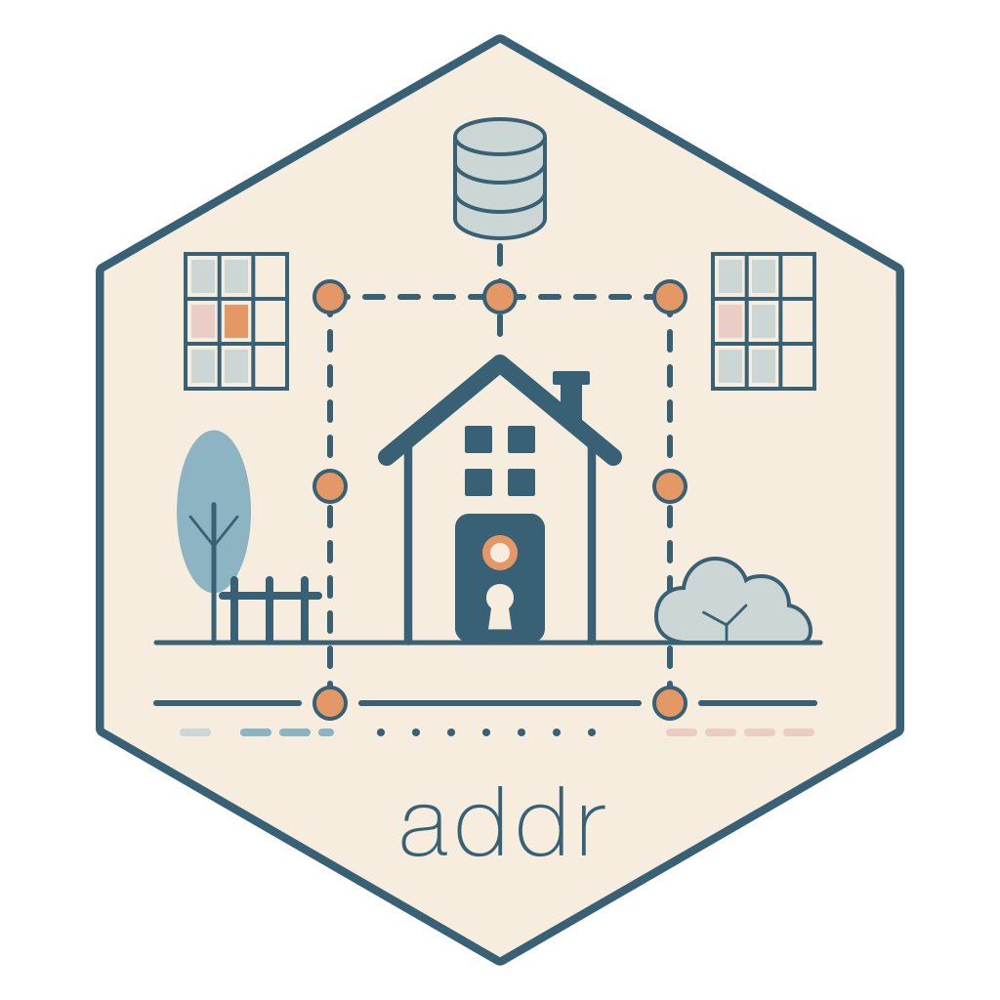
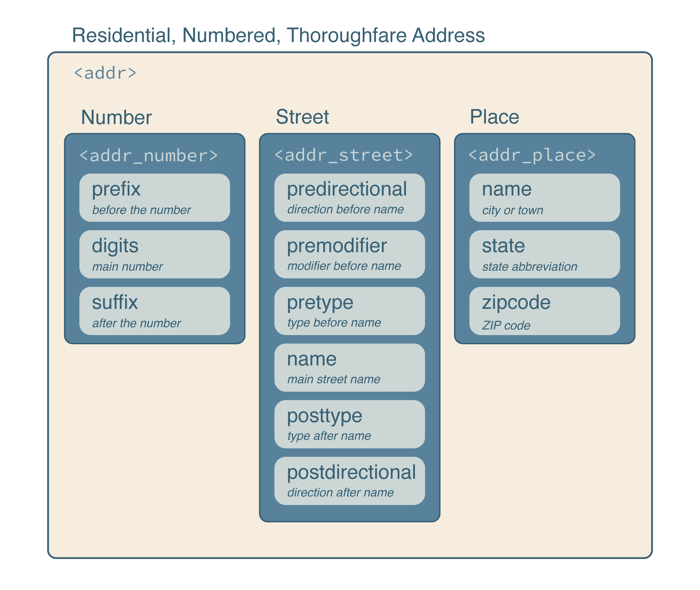
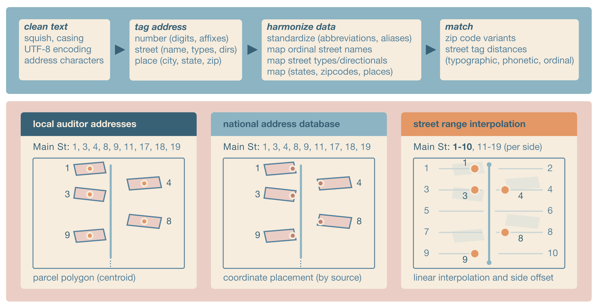

# addr 

<!-- badges: start -->

[](https://CRAN.R-project.org/package=addr)
[](https://github.com/geomarker-io/addr/actions/workflows/R-CMD-check.yaml)
[](https://github.com/geomarker-io/addr/actions/workflows/network-tests.yaml)
[](https://lifecycle.r-lib.org/articles/stages.html#stable)
[](https://geomarker-io.r-universe.dev/addr)

<!-- badges: end -->

## About

Addresses not validated at collection are often inconsistently formatted and standardized, making them difficult to compare or link to other address data.
The goal of addr is to clean, parse, standardize, match, and geocode real-world, noisy US addresses in R.

`addr` can parse address components from strings and build vctrs-based address vectors, including `addr()` vectors and the `addr_number()`, `addr_street()`, and `addr_place()` component vectors.
Each are structured to reuse the United States Thoroughfare, Landmark, and Postal Address Data Standard from the US Federal Geographic Data Committee.



The standard also facilitates efficient operations with the Department of Transportation's National Address Database for address matching and with the Census TIGER/Line Shapefiles for street-range geocoding.
Address vectors can be standardized, matched, joined, and used as data-frame columns, allowing standard R tools to work with nested address structures.

## Installation

Install the latest stable release of addr from [R-universe](https://r-universe.dev) with:

```r
install.packages("addr", repos = c("https://geomarker-io.r-universe.dev", "https://cloud.r-project.org"))
```

Or, install the development version of addr from [GitHub](https://github.com/) with:

```r
# install.packages("pak")
pak::pak("geomarker-io/addr")
```

Installing addr from GitHub requires a working [Rust](https://rust-lang.org/learn/get-started/) toolchain; install one using [rustup](https://rust-lang.org/tools/install/).

## Getting started

### addr vectors

addr vectors behave like standard R vectors: they recycle, subset, and combine with vctrs tooling.
You can parse text into an addr vector with `as_addr()` or build one from component vectors with `addr()`.

```r
as_addr(c("3333 Burnet Ave Cincinnati OH 45229",
          "5130 Rapid Run Rd Cincinnati OH 45238"))

#> <addr>
#>  @ number: <addr_number> function ()
#>  .. @ prefix: chr [1:2] "" ""
#>  .. @ digits: chr [1:2] "3333" "5130"
#>  .. @ suffix: chr [1:2] "" ""
#>  @ street: <addr_street> function ()
#>  .. @ predirectional : chr [1:2] "" ""
#>  .. @ premodifier    : chr [1:2] "" ""
#>  .. @ pretype        : chr [1:2] "" ""
#>  .. @ name           : chr [1:2] "Burnet" "Rapid Run"
#>  .. @ posttype       : chr [1:2] "Ave" "Rd"
#>  .. @ postdirectional: chr [1:2] "" ""
#>  @ place : <addr_place> function ()
#>  .. @ name   : chr [1:2] "Cincinnati" "Cincinnati"
#>  .. @ state  : chr [1:2] "OH" "OH"
#>  .. @ zipcode: chr [1:2] "45229" "45238"
```

### Address Matching

`addr_match()` compares one `addr` vector to another and returns one selected reference address for each input address.
Matching is staged: ZIP codes are matched first, then streets are matched within each matched ZIP code, then address numbers are matched within each matched ZIP/street group.
This keeps matching fast while still allowing common street-name, phonetic, ZIP-code, and address-number variation.

Use `addr_left_join()` when the goal is to join data frames with `addr` columns.
It uses the same staged matching as `addr_match()` and then expands exact duplicate reference rows when more than one row in `y` has the selected address.
Use `addr_fuzzy_left_join()` when you need all fuzzy candidate matches rather than one selected match.

For repeated matching against the same reference addresses, prepare the reference once with `addr_match_prepare()` and reuse the returned index in later `addr_match()` or `addr_left_join()` calls.

#### National Address Database

`nad()` reads county-level address points from the U.S. Department of Transportation National Address Database.
Counties can be requested by county name plus state, such as `"Hamilton", "OH"`, or by 5-digit county FIPS code, such as `"39061"`.

The nationwide NAD geodatabase is large and county-based extracts are computationally expensive, so addr caches derived county data in the R user cache directory.
The package also includes `nad_example_data()`, a small baked fixture derived from Hamilton County, Ohio. Use it for examples, tests, and matching workflows that should run without downloading NAD source data first; use `nad("Hamilton", "OH")` when you need complete Hamilton County data.

### Geocoding

Matched NAD coordinates can be used as a geocode, but placement often varies by the contributing organization and state.
If linking to parcel geographies, intersection with parcel boundaries or their centroids can be used.
Street range geocoding does not use address-level data, but instead interpolates the location with possible street ranges provided by census.gov.

In any case, geocoding includes (1) cleaning address text, (2) tagging the address, (3) harmonizing the address tags, (4) matching the ZIP code and street combinations.
Any differences between the methods arise when placing a coordinate after matching the ZIP code and street



`geocode()` converts `addr()` vectors to point locations using Census TIGER address ranges.
It matches the input street to installed TIGER address features, chooses the best address range and street side from the address number, interpolates a point along the range, and offsets that point from the street line.
Geocoding returns the input address, matched ZIP code, matched street, point s2 geography, and s2 cell.
Inputs with missing or unmatched ZIP codes, streets, or address ranges return missing geographies rather than centroids of larger areas.

#### TIGER Address Features

TIGER address features are Census street-segment address ranges.
addr stores them as a hive-partitioned, multi-file parquet dataset, grouped by ZIP-code partitions and county files, so geocoding can read only the local files needed for the input ZIP codes.

`taf_install()` installs TIGER address features for one county; however, `geocode()` installs all county files that may contain the ZIP codes in an input address vector as needed.
Read TIGER address features for one or more ZIP codes with `taf_zip()`.
`taf_needed_counties()` identifies which county files may contain the ZIP codes in an input address vector, including selected ZIP-code variants.
`taf_ensure()` installs any missing county files, and `geocode()` calls it by default before geocoding. addr uses nanoparquet for flat parquet reads and writes in these geocoding helpers. Use `taf()` to open the installed multi-file dataset with arrow for advanced lazy dataset queries; arrow is optional and is only required for `taf()`.

## Container and command-line interface

An OCI-compatible runtime image with R and addr installed is published to the GitHub Container Registry:

```sh
docker pull ghcr.io/geomarker-io/addr:v1.3.0
docker run --rm -it ghcr.io/geomarker-io/addr:v1.3.0
```

Container release tags mirror addr package release versions.
For reproducible work, use a specific release such as `ghcr.io/geomarker-io/addr:v1.3.0`.

The image does not include or pre-install TIGER/Line or National Address Database data.
Runtime data uses the standard addr user data directory under `/opt/addr-data/R/addr`.
Mount `/opt/addr-data` when you want downloads or derived data to persist across runs:

```sh
docker run --rm -it -v addr-data:/opt/addr-data ghcr.io/geomarker-io/addr:v1.3.0
```

### Batch geocoding on a cluster

The container includes an `addr-geocode` command for CSV or parquet files with a column named exactly `address`.
The command writes a deterministic output file next to the input, matching the input file type and appending TIGER range geocoding columns.
On systems that use Apptainer, pull a release-tagged image and bind user-specific scratch directories for persistent addr data and temporary files:

```sh
apptainer pull addr_v1.3.0.sif docker://ghcr.io/geomarker-io/addr:v1.3.0

mkdir -p /scratch/<cchmc-user>/addr-data /scratch/<cchmc-user>/addr-tmp

apptainer exec --cleanenv --contain \
  --bind /scratch/<cchmc-user>/addr-data:/opt/addr-data \
  --bind /scratch/<cchmc-user>/addr-tmp:/tmp \
  --bind "$PWD:/work" \
  addr_v1.3.0.sif \
  addr-geocode \
    --input /work/addresses.csv
```

For example, Cole's CCHMC username is `broeg1`, so his scratch directories use `/scratch/broeg1/`:

```sh
mkdir -p /scratch/broeg1/addr-data /scratch/broeg1/addr-tmp
```

Use `--cleanenv` and `--contain` so the container does not inherit host R environment variables, home-directory data, or temporary directories.

For local R installations, run the installed script from the shell:

```sh
Rscript "$(Rscript -e 'cat(system.file("exec", "addr-geocode", package = "addr"))')" \
  --input addresses.csv
```

You can also create a one-time shell symlink:

```sh
mkdir -p "$HOME/.local/bin"
ln -s "$(Rscript -e 'cat(system.file("exec", "addr-geocode", package = "addr"))')" \
  "$HOME/.local/bin/addr-geocode"
```

Then run:

```sh
addr-geocode --input addresses.csv
```

For local image development, use `just build`, `just run`, and `just test-container` with the `container` CLI.
The `just run` target resolves `tools::R_user_dir("addr", "data")` with the local R installation and mounts that directory into the container when it already exists.

## Full TAF bundle

The addr 1.3.0 GitHub release provides a national 2025 TIGER Address Features bundle for users who prefer one large download instead of installing county data as needed.
The bundle requires addr 1.3.0 and the `bash`, `tar`, `zstd`, and `shasum` command-line tools.

Download the archive and its small JSON manifest from the release:

```sh
curl --fail --location --remote-name \
  https://github.com/geomarker-io/addr/releases/download/v1.3.0/addr-taf-v1-2025.tar.zst
curl --fail --location --remote-name \
  https://github.com/geomarker-io/addr/releases/download/v1.3.0/addr-taf-v1-2025.json
```

Run the installer from a shell:

```sh
bash "$(Rscript -e 'cat(system.file("exec", "install-addr-taf-fuel.sh", package = "addr"))')" \
  addr-taf-v1-2025.tar.zst
```

The installer reads the JSON manifest next to the archive, verifies the embedded SHA-256 checksum, confirms package compatibility and file counts, and then installs runtime-optimized Snappy parquet files.
The download is about 1.4 GiB and installation requires several additional gigabytes of temporary and destination disk space.

By default, files are installed under the directory returned by:

```sh
Rscript -e 'cat(tools::R_user_dir("addr", "data"))'
```

Set `R_USER_DATA_DIR` before installation to use another storage location, such as scratch space on a cluster:

```sh
export R_USER_DATA_DIR=/scratch/<user>/addr-data
bash "$(Rscript -e 'cat(system.file("exec", "install-addr-taf-fuel.sh", package = "addr"))')" \
  addr-taf-v1-2025.tar.zst
```

With that setting, the installed data and manifest are placed under:

```text
${R_USER_DATA_DIR}/R/addr/v1/tiger_addr_feat/2025
${R_USER_DATA_DIR}/R/addr/v1/tiger_addr_feat_manifest/2025
```

The installer refuses to overwrite either existing year-specific directory.
Remove both directories before deliberately replacing an existing full installation, or set `R_USER_DATA_DIR` to install in a different location.
